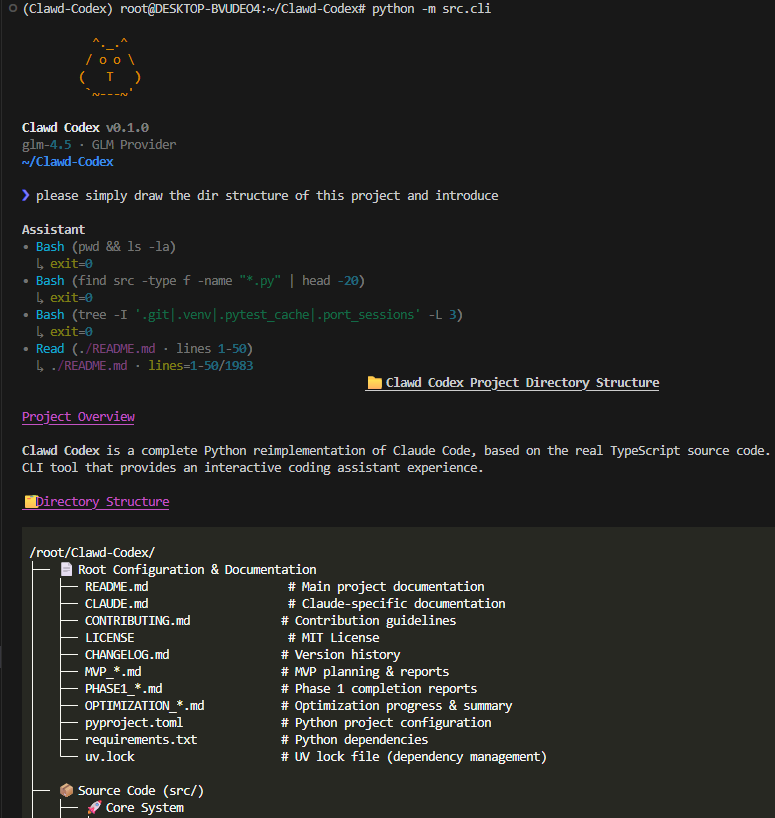
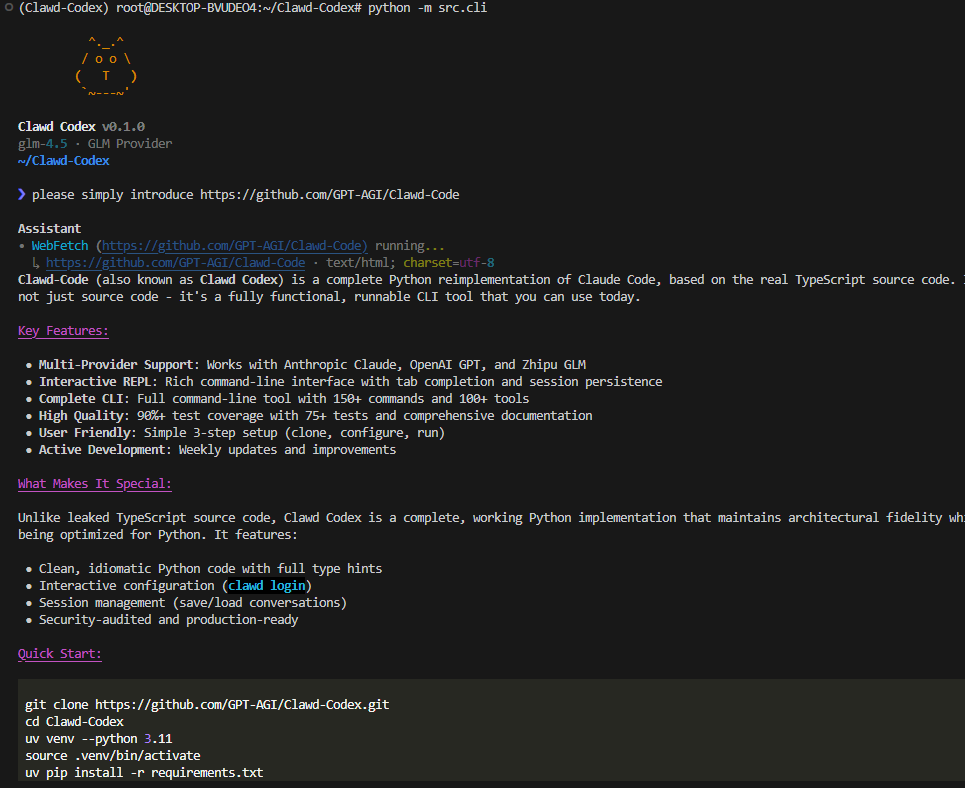
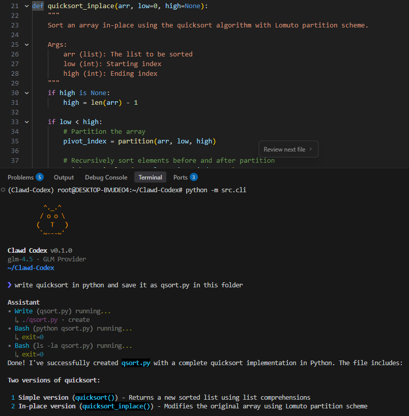
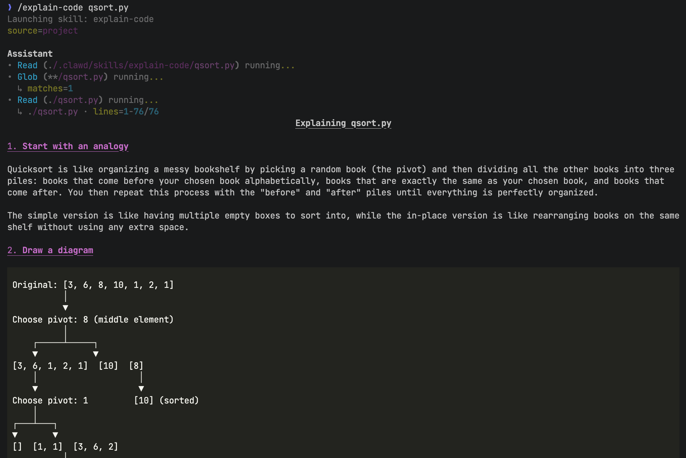
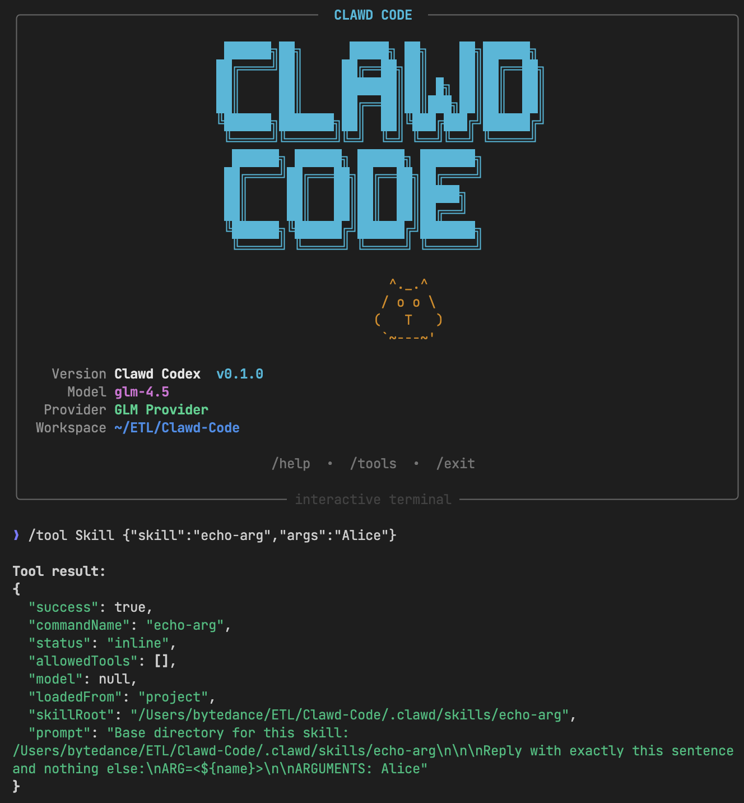

<div align="center">

[English](../../README.md) | [中文](../../README.md#中文版) | [Français](README_FR.md) | **Русский** | [हिन्दी](README_HI.md) | [العربية](README_AR.md) | [Português](README_PT.md)

# 🚀 Claude Code Python

**Полная повторная реализация на Python на основе реального исходного кода Claude Code**

*Из исходного кода TypeScript → Перестроен на Python с ❤️*

***

[](https://github.com/GPT-AGI/Clawd-Code/stargazers)
[](https://github.com/GPT-AGI/Clawd-Code/network/members)
[](https://opensource.org/licenses/MIT)
[](https://www.python.org/downloads/)

**🔥 Активная разработка • Новые функции еженедельно 🔥**

</div>

***

## 🎯 Что это?

**Clawd Codex** — это **полная переработка на Python** Claude Code, основанная на **реальном исходном коде TypeScript**.

### ⚠️ Важно: Это НЕ просто исходный код

**В отличие от утечки исходного кода TypeScript**, Clawd Codex — это **полностью функциональный инструмент CLI**:

<div align="center">

| **Core Features Showcase** |
|:---:|
|  |
| *Real-time Tool Execution* |
|  |
| *Instant Web Content Extraction* |
|  |
| *Seamless Coding & Debugging* |
|  |
| *Flexible Skill Systems* |

**Реальный CLI • Реальное использование • Реальное сообщество**

</div>

- ✅ **Работающий CLI** — Не просто код, а полностью функциональный инструмент командной строки, который вы можете использовать сегодня
- ✅ **Основан на реальном коде** — Портирован с фактической реализации Claude Code на TypeScript
- ✅ **Максимальная точность** — Сохраняет оригинальную архитектуру при оптимизации
- ✅ **Родной Python** — Чистый, идиоматичный Python с полными аннотациями типов
- ✅ **Удобство использования** — Простая настройка, интерактивный REPL, полная документация
- ✅ **Постоянное улучшение** — Улучшенная обработка ошибок, тестирование, документация

**🚀 Попробуйте сейчас! Форкните, изменяйте, сделайте своим! Pull requests приветствуются!**

***

## ⭐ Star History

<a href="https://www.star-history.com/?repos=GPT-AGI%2FClawd-Code&type=date&legend=top-left">
 <picture>
   <source media="(prefers-color-scheme: dark)" srcset="https://api.star-history.com/image?repos=GPT-AGI%2FClawd-Code&type=date&theme=dark&legend=top-left" />
   <source media="(prefers-color-scheme: light)" srcset="https://api.star-history.com/image?repos=GPT-AGI%2FClawd-Code&type=date&legend=top-left" />
   
 </picture>
</a>

## ✨ Возможности

### Поддержка нескольких провайдеров

```python
providers = ["Anthropic Claude", "OpenAI GPT", "Zhipu GLM"]  # + легко расширить
```

### Интерактивный REPL

```text
>>> Привет!
Assistant: Привет! Я Clawd Codex, повторная реализация на Python...

>>> /help         # Показать команды
>>> /             # Показать команды и skills
>>> /save         # Сохранить сессию
>>> /multiline    # Многострочный режим
>>> Tab           # Автозаполнение
>>> /explain-code qsort.py   # Запустить skill
```

### Skills (Slash Commands)

See [README.md](../../README.md#skills-slash-commands) for a quick tutorial on creating skills under `.clawd/skills/<skill-name>/SKILL.md`.

### Полный CLI

```bash
clawd              # Запустить REPL
clawd login        # Настроить API
clawd --version    # Проверить версию
clawd config       # Просмотреть настройки
```

***

## 📊 Статус

| Компонент        | Статус      | Количество     |
| ---------------- | ----------- | -------------- |
| Команды          | ✅ Завершено | 150+           |
| Инструменты      | ✅ Завершено | 100+           |
| Покрытие тестами | ✅ 90%+      | 75+ тестов     |
| Документация     | ✅ Завершено | 10+ документов |

***

## 🚀 Быстрый старт

### Установка

```bash
git clone https://github.com/GPT-AGI/Clawd-Code.git
cd Clawd-Code

# Создать venv (рекомендуется uv)
uv venv --python 3.11
source .venv/bin/activate

# Установить
uv pip install -r requirements.txt
```

### Настройка

#### Вариант 1: Интерактивный (Рекомендуется)

```bash
python -m src.cli login
```

Этот процесс:

1. попросит вас выбрать провайдера: anthropic / openai / glm
2. попросит ввести API ключ этого провайдера
3. при необходимости сохранит пользовательский base URL
4. при необходимости сохранит модель по умолчанию
5. установит выбранный провайдер как провайдера по умолчанию

Файл конфигурации сохраняется в `~/.clawd/config.json`. Пример структуры:

```json
{
  "default_provider": "glm",
  "providers": {
    "anthropic": {
      "api_key": "base64-encoded-key",
      "base_url": "https://api.anthropic.com",
      "default_model": "claude-sonnet-4-20250514"
    },
    "openai": {
      "api_key": "base64-encoded-key",
      "base_url": "https://api.openai.com/v1",
      "default_model": "gpt-4"
    },
    "glm": {
      "api_key": "base64-encoded-key",
      "base_url": "https://open.bigmodel.cn/api/paas/v4",
      "default_model": "glm-4.5"
    }
  }
}
```

### Запуск

```bash
python -m src.cli          # Запустить REPL
python -m src.cli --help   # Показать справку
```

**Вот и всё!** Начните общаться с ИИ за 3 шага.

***

## 💡 Использование

### Команды REPL

| Команда      | Описание                        |
| ------------ | ------------------------------- |
| `/help`      | Показать все команды            |
| `/save`      | Сохранить сессию                |
| `/load <id>` | Загрузить сессию                |
| `/multiline` | Переключить многострочный режим |
| `/clear`     | Очистить историю                |
| `/exit`      | Выйти из REPL                   |

### Пример сессии



***

## 🎓 Почему Clawd Codex?

### Основан на реальном исходном коде

- **Не клон** — Портирован с реальной реализации на TypeScript
- **Архитектурная точность** — Сохраняет проверенные шаблоны проектирования
- **Улучшения** — Лучшая обработка ошибок, больше тестов, чище код

### Родной Python

- **Аннотации типов** — Полные аннотации типов
- **Современный Python** — Использует возможности 3.10+
- **Идиоматичный** — Чистый Python код

### Нацелен на пользователя

- **3-шаговая настройка** — Клонировать, настроить, запустить
- **Интерактивная настройка** — `clawd login` направляет вас
- **Богатый REPL** — Автозаполнение табуляцией, подсветка синтаксиса
- **Сохранение сессий** — Никогда не теряйте свою работу

***

## 📦 Структура проекта

```text
Clawd-Code/
├── src/
│   ├── cli.py           # Точка входа CLI
│   ├── config.py        # Конфигурация
│   ├── repl/            # Интерактивный REPL
│   ├── providers/       # LLM провайдеры
│   └── agent/           # Управление сессиями
├── tests/               # 75+ тестов
└── docs/                # Полная документация
```

***

## 🗺️ Дорожная карта

- [x] Python MVP
- [x] Поддержка нескольких провайдеров
- [x] Сохранение сессий
- [x] Аудит безопасности
- [ ] Система вызова инструментов
- [ ] Пакет PyPI
- [ ] Версия на Go

***

## 🤝 Участие

**Мы приветствуем участие!**

```bash
# Быстрая настройка для разработки
pip install -e .[dev]
python -m pytest tests/ -v
```

См. [CONTRIBUTING.md](../../CONTRIBUTING.md) для руководства.

***

## 📖 Документация

- **[SETUP_GUIDE.md](../guide/SETUP_GUIDE.md)** — Подробная установка
- **[CONTRIBUTING.md](../../CONTRIBUTING.md)** — Руководство по разработке
- **[TESTING.md](../guide/TESTING.md)** — Руководство по тестированию
- **[CHANGELOG.md](../../CHANGELOG.md)** — История версий

***

## ⚡ Производительность

- **Запуск**: < 1 секунды
- **Память**: < 50MB
- **Ответ**: Потоковая передача (реальное время)

***

## 🔒 Безопасность

✅ **Проверка безопасности пройдена**

- Нет конфиденциальных данных в Git
- API ключи зашифрованы в конфигурации
- Файлы `.env` игнорируются
- Безопасно для продакшена

***

## 📄 Лицензия

MIT Лицензия — См. [LICENSE](../../LICENSE)

***

## 🙏 Благодарности

- Основано на исходном коде Claude Code TypeScript
- Независимый образовательный проект
- Не связан с Anthropic

***

<div align="center">

### 🌟 Покажите свою поддержку

Если вы нашли это полезным, пожалуйста, **star** ⭐ репозиторий!

**Сделано с ❤️ командой Clawd Codex**

[⬆ Наверх](#-clawd-codex)

</div>
